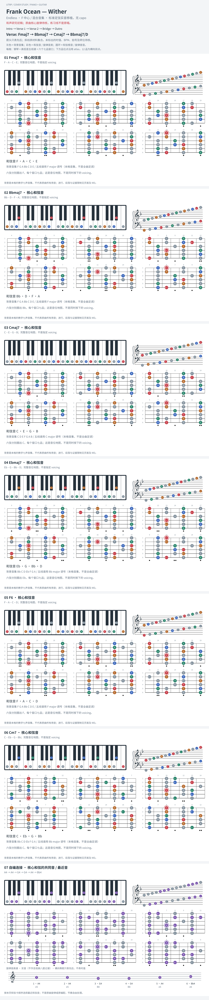

# Frank Ocean — Wither

- 专辑：Endless；工作调性：**F 中心 / 混合音集**。
- 值得扒：不同大七色彩并置。
- 原表：F / Dm · F major（保留追踪，不代表正确）。
- 状态：和声研究初稿；原曲核心旋律待核，练习线不是原唱。

## 结构与进行

Intro → Verse 1 → Verse 2 → Bridge → Outro。

`Verse: Fmaj7 → Bbmaj7 → Cmaj7 → Bbmaj7/D`

capo 3 谱已换算实音；首句 F 三和弦后转 Fmaj7。Verse 2: Ebmaj7 → F6 → Bbmaj7 → Cmaj7，再 Cm7 → F7 → C7/Bb → Fmaj7/C。

## 核心旋律

**待核**：本轮尚未取得并核验逐音主旋律谱；图中自编拆和弦练习不替代原曲核心旋律。

七品 × 六把位；下方品位点；钢琴与高低音五线谱。标准定弦、实音显示。灰色七声音集是本格教学背景，不是整首歌的唯一音阶；彩色点是音位而非同时按下的 voicing。

## 来源与限制

- [参考 1](https://www.chords-and-tabs.net/song/name/frank-ocean-wither)
- [参考 2](https://www.reddit.com/r/FrankOcean/comments/59xvvh/here_are_the_chords_to_wither/)

按公开谱例/文字分析整理，未声称已听辨原录音或看完视频。没有复制歌词或完整商业谱。
