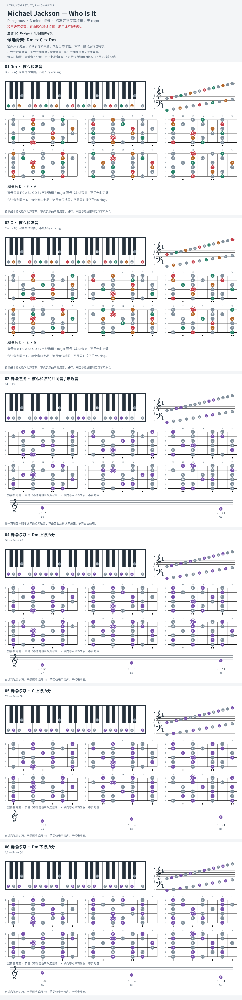

# Michael Jackson — Who Is It

- 专辑：Dangerous；工作调性：**D minor 待核**。
- 值得扒：小调 bass ostinato 与切分旋律。
- 原表：F / Dm · F major（保留追踪，不代表正确）。
- 状态：和声研究初稿；原曲核心旋律待核，练习线不是原唱。

## 结构与进行

主循环；Bridge 和段落拍数待核。

`候选骨架: Dm → C → Dm`

原表 F 仅是相对大调分组；当前只有简化机器和弦候选，不能当作准确扒谱。

## 核心旋律

**待核**：本轮尚未取得并核验逐音主旋律谱；图中自编拆和弦练习不替代原曲核心旋律。

七品 × 六把位；下方品位点；钢琴与高低音五线谱。标准定弦、实音显示。灰色七声音集是本格教学背景，不是整首歌的唯一音阶；彩色点是音位而非同时按下的 voicing。

## 来源与限制

- [参考 1](https://chordu.com/tabs/who-is-it-chords-by-michael-jackson-id_0x18ecd)

按公开谱例/文字分析整理，未声称已听辨原录音或看完视频。没有复制歌词或完整商业谱。
