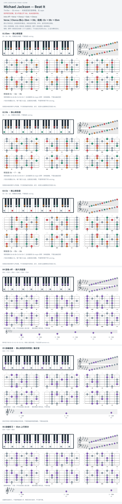

# Michael Jackson — Beat It

- 专辑：Thriller；工作调性：**Eb minor**。
- 值得扒：riff 的小调骨架与节奏张力。
- 原表：Gb / Ebm · Eb minor（保留追踪，不代表正确）。
- 状态：和声研究初稿；短 riff 据公开 TAB，尚未逐音听核。

## 结构与进行

Intro riff → Verse → Chorus → Solo → Chorus。

`Verse / Chorus 核心: Ebm → Db；段尾: Cb → Db → Ebm`

原谱吉他降半音定弦、Em 指型；本页换算 Ebm 实音并移植标准定弦。和弦卡是和声补全，原吉他多为 power chord。

## 核心旋律

已附短 riff 摘录；不是整曲主唱旋律，节奏仍请对照来源。

七品 × 六把位；下方品位点；钢琴与高低音五线谱。标准定弦、实音显示。灰色七声音集是本格教学背景，不是整首歌的唯一音阶；彩色点是音位而非同时按下的 voicing。

## 来源与限制

- [参考 1](https://www.cifraclub.com/michael-jackson/beat-it/)

按公开谱例/文字分析整理，未声称已听辨原录音或看完视频。没有复制歌词或完整商业谱。
