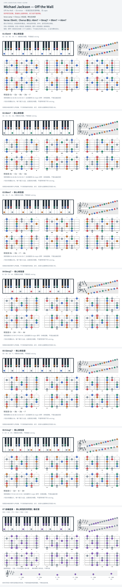

# Michael Jackson — Off the Wall

- 专辑：Off the Wall；工作调性：**Eb minor**。
- 值得扒：九和弦与半音侧移。
- 状态：和声研究初稿；原曲核心旋律待核，练习线不是原唱。

## 结构与进行

Verse vamp → Chorus / 对比段；转位见来源。

`Verse: Ebm9；Chorus 核心: Abm7 → Bmaj7 → Bbm7 → Abm7`

参考谱混用 B / Cb、F# / Gb 拼法；此页保留声音对应，卡片按局部音集等音规范化。

## 核心旋律

**待核**：本轮尚未取得并核验逐音主旋律谱；图中自编拆和弦练习不替代原曲核心旋律。

七品 × 六把位；下方品位点；钢琴与高低音五线谱。标准定弦、实音显示。灰色七声音集是本格教学背景，不是整首歌的唯一音阶；彩色点是音位而非同时按下的 voicing。

## 来源与限制

- [参考 1](https://www.cifraclub.com/michael-jackson/off-the-wall/)

按公开谱例/文字分析整理，未声称已听辨原录音或看完视频。没有复制歌词或完整商业谱。
