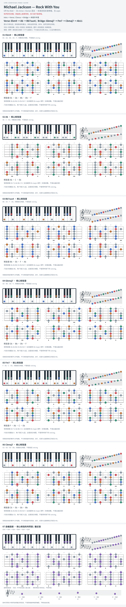

# Michael Jackson — Rock With You

- 专辑：Off the Wall；工作调性：**Eb minor / Dorian 混合**。
- 值得扒：Dorian 的大 IV 与跨调桥段。
- 原表：Db / Bbm · Db major（保留追踪，不代表正确）。
- 状态：和声研究初稿；原曲核心旋律待核，练习线不是原唱。

## 结构与进行

Intro → Verse / Chorus → Bridge → 末段升半音。

`Verse: Ebm9 → Ab → Bb7sus4；Bridge: Gbmaj7 → Fm7 → Cbmaj7 → Ab11`

原表 Db 改 Ebm 中心；Bb11 以 Bb7sus4 核心音简化，未声称包含全部延伸。末段 Em 不在本页卡片中。

## 核心旋律

**待核**：本轮尚未取得并核验逐音主旋律谱；图中自编拆和弦练习不替代原曲核心旋律。

七品 × 六把位；下方品位点；钢琴与高低音五线谱。标准定弦、实音显示。灰色七声音集是本格教学背景，不是整首歌的唯一音阶；彩色点是音位而非同时按下的 voicing。

## 来源与限制

- [参考 1](https://spytunes.com/rock-with-you-chords/)
- [参考 2](https://www.markusottenberg.de/downloads/Rock-With-You-Michael-Jackson.pdf)

按公开谱例/文字分析整理，未声称已听辨原录音或看完视频。没有复制歌词或完整商业谱。
