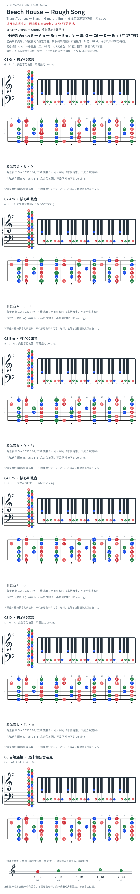

# Beach House — Rough Song

- 专辑：Thank Your Lucky Stars；工作调性：**G major / Em**。
- 值得扒：级进 bass 与 iii–vi 的柔和落点。
- 状态：进行有来源冲突；原曲核心旋律待核，练习线不是原唱。

## 结构与进行

Verse → Chorus → Outro；精确重复次数待核。

`旧候选 Verse: G → Am → Bm → Em；另一谱: G → C6 → D → Em（冲突待核）`

搜索索引恢复 YouTube 作者描述的旧 Verse/Chorus 候选；E-Chords 给 G/C6/D/Em，且部分 TAB 指型与和弦名不一致。原作者描述并非原录音认证，保留不同解读待听核。

## 核心旋律

**待核**：本轮尚未取得并核验逐音主旋律谱；图中自编拆和弦练习不替代原曲核心旋律。

七品 × 六把位；下方品位点；钢琴与高低音五线谱。标准定弦、实音显示。箭头只表先后；和弦名内 / 指定低音，其余斜线分隔材料或段落。时值、BPM、拍号及未标转位待核。灰色七声音集是本格教学背景，不是整首歌的唯一音阶；彩色点是音位而非同时按下的 voicing。

## 来源与限制

- [参考 1](https://www.youtube.com/watch?v=-WYtRJlxo7o)
- [参考 2](https://www.hooktheory.com/theorytab/view/beach-house/rough-song)

按公开谱例/文字分析整理，未声称已听辨原录音或看完视频。没有复制歌词或完整商业谱。

- [复核补充来源](https://www.e-chords.com/chords/beach-house/rough-song)

## 复核记录（2026-10-04）

搜索索引恢复原 YouTube 作者描述：Verse G/Am/Bm/Em、Chorus G/Bm/D/Em。E-Chords 的 G/C6/D/Em 与之冲突且内部指型有疑点；候选有来源但并非定论，未观看视频或听核原录音。

本轮检查了数据、音高/弦品及可取得的引用内容；未逐段听核原录音，发行曲目归属核对不等于录音版本及完整演职员表已核验。图中的自编逐卡选音不保证最短声部连接，卡序不等于原曲进行。

## 曲目信息复核

已对照所列发行曲目表核对主艺人、曲名与所属专辑；不是完整演职员表，也不证明所用谱对应特定录音版本。

- [曲目信息来源 1](https://beachhouse.bandcamp.com/album/thank-your-lucky-stars)
