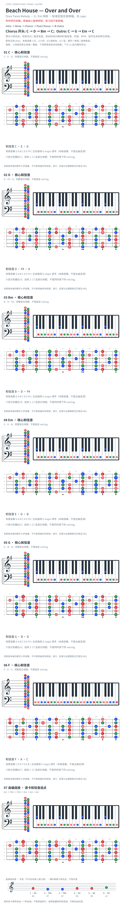

# Beach House — Over and Over

- 专辑：Once Twice Melody；工作调性：**G / Em 待核**。
- 值得扒：持续循环的内声部与相对 G 中心的借用 bVII。
- 状态：和声研究初稿；原曲核心旋律待核，练习线不是原唱。

## 结构与进行

Intro → Verse → Chorus → Post-Chorus → 长 Outro。

`Chorus 开头: C → D → Bm → C；Outro: C → G → Em → C`

Post-Chorus 另有 F → C → G → Em。归组按所引 Chorus/Outro 音集分析，整体主音仍待录音核验。 Chorus 后续另有 Bm→G、Bm→C、Bm→Em，并非只循环标题四和弦。

## 核心旋律

**待核**：本轮尚未取得并核验逐音主旋律谱；图中自编拆和弦练习不替代原曲核心旋律。

七品 × 六把位；下方品位点；钢琴与高低音五线谱。标准定弦、实音显示。箭头只表先后；和弦名内 / 指定低音，其余斜线分隔材料或段落。时值、BPM、拍号及未标转位待核。灰色七声音集是本格教学背景，不是整首歌的唯一音阶；彩色点是音位而非同时按下的 voicing。

## 来源与限制

- [参考 1](https://www.cifraclub.com/beach-house/over-and-over/)

按公开谱例/文字分析整理，未声称已听辨原录音或看完视频。没有复制歌词或完整商业谱。

## 复核记录（2026-10-04）

Cifra Club 含 Verse，已补结构标签；Chorus 的 C/D/Bm/C 仅是开头，后续 Bm/G、Bm/C、Bm/Em 未在标题全写。页面 Am 标注不作为整体主音定论。

本轮检查了数据、音高/弦品及可取得的引用内容；未逐段听核原录音，发行曲目归属核对不等于录音版本及完整演职员表已核验。图中的自编逐卡选音不保证最短声部连接，卡序不等于原曲进行。

## 曲目信息复核

已对照所列发行曲目表核对主艺人、曲名与所属专辑；不是完整演职员表，也不证明所用谱对应特定录音版本。

- [曲目信息来源 1](https://www.subpop.com/releases/beach_house/once_twice_melody)
