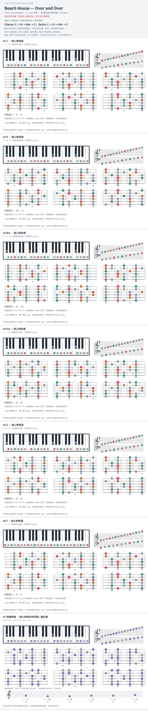

# Beach House — Over and Over

- 专辑：Once Twice Melody；工作调性：**G / Em 待核**。
- 值得扒：持续循环的内声部与借用 bVII。
- 状态：和声研究初稿；原曲核心旋律待核，练习线不是原唱。

## 结构与进行

Intro → Chorus → Post-Chorus → 长 Outro。

`Chorus: C → D → Bm → C；Outro: C → G → Em → C`

Post-Chorus 另有 F → C → G → Em。归组按所引 Chorus/Outro 音集分析，整体主音仍待录音核验。

## 核心旋律

**待核**：本轮尚未取得并核验逐音主旋律谱；图中自编拆和弦练习不替代原曲核心旋律。

七品 × 六把位；下方品位点；钢琴与高低音五线谱。标准定弦、实音显示。灰色七声音集是本格教学背景，不是整首歌的唯一音阶；彩色点是音位而非同时按下的 voicing。

## 来源与限制

- [参考 1](https://www.cifraclub.com/beach-house/over-and-over/)

按公开谱例/文字分析整理，未声称已听辨原录音或看完视频。没有复制歌词或完整商业谱。
