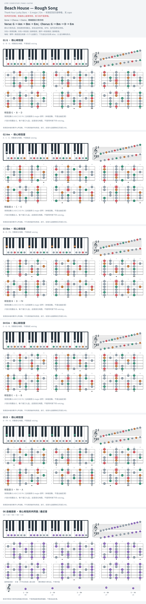

# Beach House — Rough Song

- 专辑：Thank Your Lucky Stars；工作调性：**G major / Em**。
- 值得扒：级进 bass 与 iii–vi 的柔和落点。
- 状态：和声研究初稿；原曲核心旋律待核，练习线不是原唱。

## 结构与进行

Verse → Chorus → Outro；精确重复次数待核。

`Verse: G → Am → Bm → Em；Chorus: G → Bm → D → Em`

和声取自翻弹作者的文字说明，未假称观看/听辨其视频；三和弦骨架不等于完整键盘织体。

## 核心旋律

**待核**：本轮尚未取得并核验逐音主旋律谱；图中自编拆和弦练习不替代原曲核心旋律。

七品 × 六把位；下方品位点；钢琴与高低音五线谱。标准定弦、实音显示。灰色七声音集是本格教学背景，不是整首歌的唯一音阶；彩色点是音位而非同时按下的 voicing。

## 来源与限制

- [参考 1](https://www.youtube.com/watch?v=-WYtRJlxo7o)
- [参考 2](https://www.hooktheory.com/theorytab/view/beach-house/rough-song)

按公开谱例/文字分析整理，未声称已听辨原录音或看完视频。没有复制歌词或完整商业谱。
