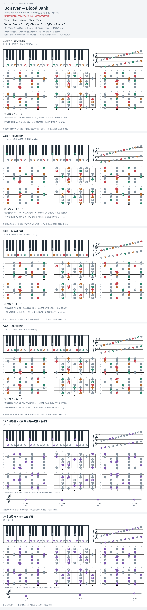

# Bon Iver — Blood Bank

- 专辑：Blood Bank；工作调性：**E minor / G**。
- 值得扒：开放弦共鸣与下行 bass。
- 状态：和声研究初稿；原曲核心旋律待核，练习线不是原唱。

## 结构与进行

Verse → Chorus → Verse → Chorus / Outro。

`Verse: Em → D → C；Chorus: G → D/F# → Em → C`

本页是标准定弦等实音练习；不是原演奏的特殊定弦复原，D/F# 的低音请保留。

## 核心旋律

**待核**：本轮尚未取得并核验逐音主旋律谱；图中自编拆和弦练习不替代原曲核心旋律。

七品 × 六把位；下方品位点；钢琴与高低音五线谱。标准定弦、实音显示。灰色七声音集是本格教学背景，不是整首歌的唯一音阶；彩色点是音位而非同时按下的 voicing。

## 来源与限制

- [参考 1](https://www.songsterr.com/a/wsa/bon-iver-blood-bank-chords-s371874)
- [参考 2](https://www.youtube.com/watch?v=dno6sP_t9zc)

按公开谱例/文字分析整理，未声称已听辨原录音或看完视频。没有复制歌词或完整商业谱。
