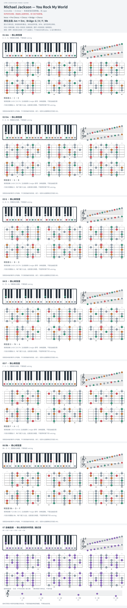

# Michael Jackson — You Rock My World

- 专辑：Invincible；工作调性：**E minor**。
- 值得扒：minor vamp 与桥段外来音。
- 状态：和声研究初稿；原曲核心旋律待核，练习线不是原唱。

## 结构与进行

Verse → Pre-Chorus → Chorus → Bridge → Chorus。

`简化主段: Am ↔ Em；Bridge: G / D / F / Bb`

所引简谱省略了部分七度和经过和弦；Bridge 的斜线为材料集合，不假装已经确认顺序。

## 核心旋律

**待核**：本轮尚未取得并核验逐音主旋律谱；图中自编拆和弦练习不替代原曲核心旋律。

七品 × 六把位；下方品位点；钢琴与高低音五线谱。标准定弦、实音显示。灰色七声音集是本格教学背景，不是整首歌的唯一音阶；彩色点是音位而非同时按下的 voicing。

## 来源与限制

- [参考 1](https://www.e-chords.com/chords/michael-jackson/you-rock-my-world)

按公开谱例/文字分析整理，未声称已听辨原录音或看完视频。没有复制歌词或完整商业谱。
