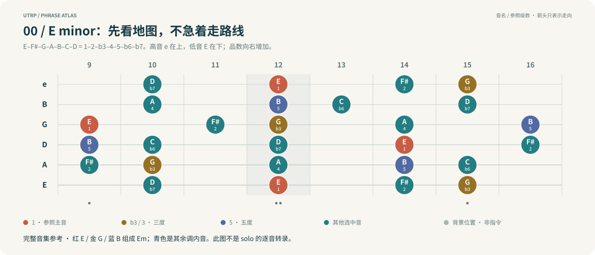
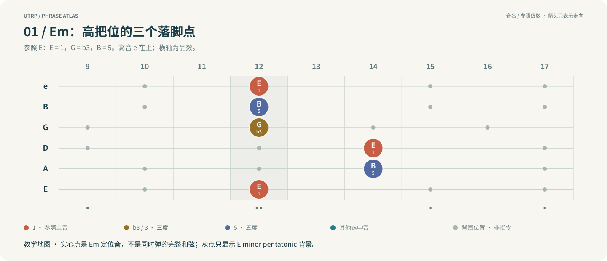
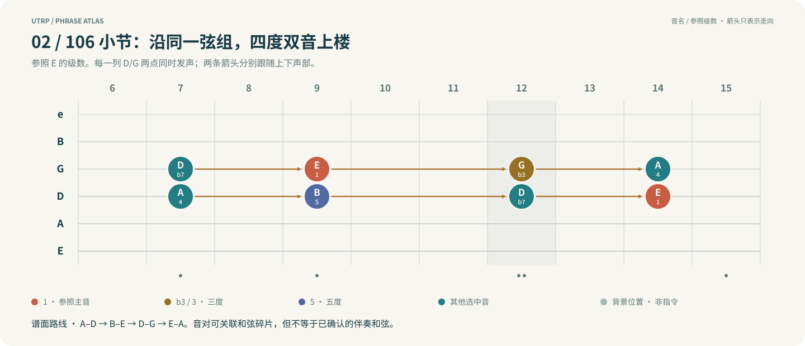
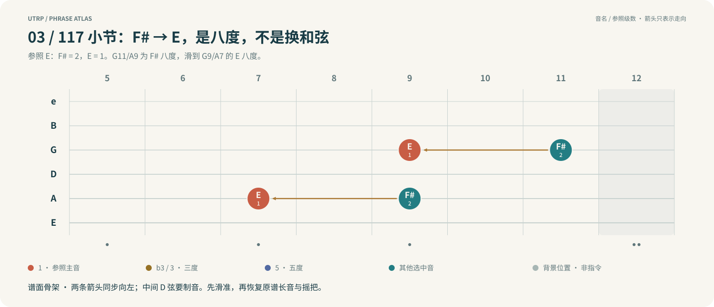
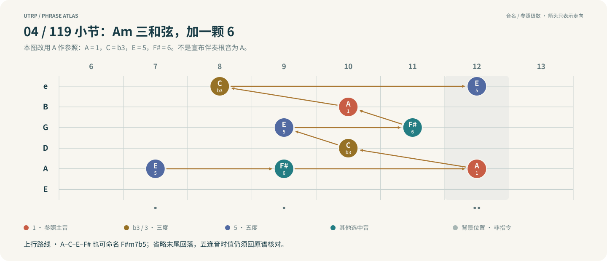

# Drown：Mateus Asato solo 的指板与结构骨架

[English](drown-mateus-skeleton.md)

分析日期：2026-10-01。目标：已内化指板图的演奏者，通过调性材料、和弦碎片、把位路线与乐句功能掌握作品，而非逐音背 TAB。

**看图顺序：音阶地图 → Em 地标 → 四度上行 → 八度下行 → 四音琶音。** 每张图紧贴对应解释；红＝参照主音，金＝三度，蓝＝五度，青＝其他选中音，灰＝背景。圆点同时写音名和级数，不只靠颜色。

## 0. 来源与证据边界

- 本地谱：`Drown feat. Mateus Asato.pdf`；复制来源与 SHA-256 见 [manifest.json](manifest.json)。原文件来自用户现有收藏，未核验购买凭证。
- 实际阅读：第 1 页和第 14–21 页；细节处放大核对 TAB 弦线。不是仅用 PDF 抽取文本作分析。
- 分析对象：标注 `Mateus` 的独立声部。105–136 小节构成 32 小节主段，137 小节还有收尾滑音。
- 原谱：Standard tuning，E–A–D–G–B–e，4/4，四分音符 = 191。可用 95.5 的 half-time 大拍感练习，但不改变原小节编号。
- **谱面事实**：以下弦品、音集合、重复关系和技法来自这份 PDF。
- **分析推断**：E minor 工作中心、和弦碎片命名和乐句功能是本分析的解释，不是作者自述。
- **教学提炼**：分段、记忆口令和练习步骤是训练用 reduction，不是完整转录。
- **限制**：solo 主段的 Tim／Scott 声部为空，也没有 bass 声部或和弦符号。因此不能从本谱核实逐小节伴奏和弦／Roman numerals。没有在本次分析中听原录音或逐帧核对演奏视频，音准、谱误与原指法仍可进一步校验。

## 1. 一句话骨架

**以 E minor pentatonic 为基地：低把位和弦碎片与双音上行 → 高把位单音问答 → 中把位双音／八度 → 一次清楚的四音琶音上行 → 重复的长下行句 → 推弦高潮 → 双音回归与 tapping 收束。**

你首先要记的是“从哪里出发、通过哪种操作、停在哪里、留多长空白”，而不是整段品数。

## 2. 调性材料：不要给每个半音另找一个调式

| 层级 | 材料 | 在本段中的作用 |
|---|---|---|
| 主干 | E minor pentatonic：E–G–A–B–D；相对 E 为 1–♭3–4–5–♭7 | 单音语汇和高把位记忆基地，尤其 109–110、129–131 |
| 扩充 | F# = 2、C = ♭6 | 与主干合成 E natural minor 音集合；123–126 有 F#，111、119、127 可见 C |
| 特定和弦音集合 | A–C–E–F# | 119 的琶音材料；可理解为 Am6 或 F#m7b5 的同一音集合 |
| 表情／半音 | 邻近半音滑动、A–Bb–A 装饰、弯音与摇把变化等 | 连接与制造张力，不自动构成转调 |

E minor 是结合 Em voicing、五声音阶密度及相关落点采用的**工作中心**；G major 与其共用音集合，单看调内音不能证明中心。谱上没有统一调号，也不意味着 C major。

同样不能把所有非调内音当成可删除的小装饰：121–122 的高音 Eb 长音向 E 推进，是一整段张力过程，应保留其时值与目的音。

**读图动作：先找红色 E，再连出金色 G、蓝色 B；这就是 Em 骨架。** 其余音是可用材料，不要求照图跑一遍。这里的级数相对 E，不是相对尚未核实的伴奏和弦。

## 3. 指板导航：少量落脚点，而非另一张音阶图

记法：`D5` = D 弦／第 4 弦第 5 品；`G4` = 第 3 弦第 4 品。`e` 为高音第 1 弦，`E` 为低音第 6 弦。

### 3.1 先点亮这些和弦音

| 地标 | 少量定位坐标 | 原谱使用／解释 |
|---|---|---|
| 低把位 G | D5=G，G4=B，B3=D | 105 把 G–B 与 B–D 两个双音碎片依次展开；不是一次完整扫三和弦 |
| 中把位 E minor 根音 | G9=E；与 D9=B 配对 | 105 末的 B–E 四度双音，可作为 Em/B 的两音碎片；不等于确认伴奏为 Em/B |
| 高把位 Em | G12=G，B12=B，e12=E | 123、125 起手确有这个 Em 三和弦；它是快速返回高把位的定位基准 |
| C/G 地标 | G12=G，B13=C；补全 e12=E | 111 使用 G–C 双音；补上 E 只是解释 C/G 形状，不是说该处三音同时弹出 |
| D/F# 地标 | G11=F#，B10=A；补全 e10=D | 112 开头使用 F#–A；完整 D/F# 是定位辅助，不是已核实的伴奏 |
| 119 琶音地标 | A12=A，D10=C，G9=E，G11=F# | 沿线展开 A–C–E–F#；这里给的是路标，不要求同时按成一个和弦 |

这些只是 fingerboard landmarks。**弹出某和弦的部分音，不等于伴奏此刻就是该和弦。**

**先记 12 品高三弦 G–B–E，再把它接到较低弦上的 E／B。** 实心点是定位地标；灰点只是五声音阶背景，不是本句必须弹的音。

### 3.2 两条重要移动路线

**路线 A：沿 D/G 弦双音上楼。** 106 的同品双音可按以下“低音→高音”理解：

| D/G 同品位置 | 音对 | 可关联的和弦碎片 |
|---|---|---|
| 7 品 | A–D | D/A |
| 9 品 | B–E | Em/B |
| 12 品 | D–G | G/D |
| 14 品 | E–A | Am/E |

这是平行四度双音的路线，不是四个已经确认的伴奏和弦。105 末已经预先触到 9 品；106 从 7 品启动上行。用“弦组＋四度形状＋目标区域”代替孤立品数记忆。

**手上只记一个动作：D/G 同品两音一起移动，7 → 9 → 12 → 14。** 先单弹上声部 D→E→G→A，再加下声部；箭头表示路线，不表示音符时值。

**路线 B：高把位 Em → 中把位双音 → 高把位 Em。**

`12–16 品问答 → 11–7 品下行 → 5–9 品双音 → 7–12 品琶音上行 → 12 品 Em 起手 → 向低弦下降 → 12–17 品高潮 → 9–5 品收束`

这里的范围是乐句覆盖区，不是要求手始终保持固定四品指型。

## 4. 逐句结构卡片

以下“先练”均为教学提炼。实际时值和连音以 PDF 为准，不把表格当替代谱。

### A｜105–108，p14：和弦碎片带你换把

- **起点**：3–5 品 G 三和弦碎片。105 的两组双音分别做低半音邻接后返回，听觉重点是“离开稳定音→回来”。
- **操作**：先在局部横向擦过半音，再沿 D/G 弦的四度双音进入 12–14 品；107 在更高位置形成 B–D 双音停留，并带摇把处理。
- **呼吸**：108 有显著休止，末尾三连音接向下一句。不要为连接顺滑而填掉空白。
- **先练**：105 只弹两个 G 和弦碎片；106 只弹四度路标；107 留住双音；108 先数空拍再进入。之后再补邻音和 slide。
- **口令**：`G 碎片 → 四度上楼 → 停 → 三连音引句`。

### B｜109–114，p15–16：单音问答，然后降低音区

- **109–110**：围绕 12–14 品的 E minor pentatonic。G12=G、G14=A 是显眼的旋律点；109 延长 A，110 回应在 G。两句不是从头到尾均匀跑音阶。
- **111–112**：从 G–C 双音碎片，经过上声部装饰，转向 F#–B 与 F#–A 等音对，再做下行／半音连接。这是 voice leading，不必每对音都强行另立一个和弦。
- **113–114**：G 弦 11 品 F# 向 G 的半音推弦及摇把表情，G12 还标有 1/4 推弦；随后退到 D 弦附近的中把位，G 是清楚的落脚点之一。
- **先练**：唱出 109 的 A 与 110 的 G；把 111–112 的上下声部分开唱／弹；114 只保留 G 落点和进入它的节奏。
- **口令**：`A 提问 → G 回答 → 双音向下 → 中把位落地`。
- **注意**：A 是相对 E 的 4，不因它时值长就自动成为当前伴奏的 chord tone。

### C｜115–118，p16–17：双音压缩成八度，再留白

- **区域**：以 5–11 品为主。
- **115**：D/G 弦的 A–D 四度到 B–D 小三度等变化。保持部分上声部时改变下声部，比把每次动作都记成新 grip 更省力。
- **116**：A/D 弦出现 E–A、F#–A 等音对，继续改变双音内部关系。
- **117**：A9=F# 与 G11=F# 构成八度，滑至 A7=E 与 G9=E，再用摇把延展。这里是**八度，不是普通三度双音，也不是两个不同和弦根音**。
- **118**：主要留白，末端 A8=F 的滑入点引向下一句 E；不要把这个接近音解释成已经转调。
- **先练**：117 去掉摇把，先把 F# 八度→E 八度滑准；再恢复持续时间、摇把和 118 的空白。
- **口令**：`双音内部变化 → F#–E 八度 → 空间`。

**同一形状整体左移两品：F# 八度 → E 八度。** 先看 G 弦与 A 弦的两条路线，中间 D 弦不发声；不要拆成四个互不相关的音。

### D｜119–122，p17–18：本段最值得单独记的琶音材料

- **119 的音集合**：E、F#、A、C；跨弦上行并伸到高音区。读作 `Am 三和弦 + 6` 很直观，也可读作 `F#m7b5`。这里只命名材料，未判定实际和弦功能。
- **性质**：主要以和弦音展开，不是普通 E minor 顺阶爬升；谱面以两组五连音组织这一小节。
- **120**：回到带摇把、推弦和休止的短句，节奏密度骤降。
- **121–122**：e11=Eb 长音，半音推到 E，随后以 B 弦 12 品的 B 回应。Eb 是持续的表现性张力，不能只当作瞬间经过音删除。
- **先练**：先找 A–C–E，再加 F#；接着按谱的两个五连音节奏跨弦。长音段单独练“持续张力→目标 E→休止→B”，不追求一直填音。
- **口令**：`Am + 6 上行 → 稀疏回答 → 长张力推向 E`。

**不是另一张音阶：只展开 A–C–E，再加入 F#。** 本图为便于看出 `1–♭3–5–6`，参照改为 A，所以 E 变蓝、A 变红；并不意味着转调或已确认 Am6 伴奏。箭头省略最后回到 C 的收尾，实际两组五连音回原谱练。

### E｜123–126，p18–19：同一长句重复，别学成两段新东西

- **事实**：125–126 复用了 123–124 的主要音高／弦品路线；124 末另标有摇把处理，因此不能把表情也当成完全相同。
- **起点**：G12/B12/e12 的 Em 三和弦起手，随后高音区展开。
- **下行材料**：E minor pentatonic 主干中加入 F#，再在 A 弦 A–Bb–A 做局部半音装饰，继续向低弦走。
- **性质**：`和弦起手 + 旋律／音阶下行 + 半音装饰`，不是整段连续 Em 琶音。
- **节奏**：五连音是这条长线的重要组织方式。先数清每组覆盖的拍子，再接组与组；不能按匀速十六分音符替代。
- **先练**：Em 起手→高点 G→跨到较低弦→低弦 D 的路线；这只是稀疏练习版。先学一次再重复，第二次保留原谱表情差异。
- **口令**：`Em 打开 → 高点 → 长下行 → 再说一次`。

### F｜127–132，p19–20：再抬高音区，靠推弦而不是多塞音制造高潮

- **127**：D 弦 C–D–E 的局部上行，并进入更高位置。可把 C、E 与后续 G 当作 C 三和弦地标来记，D 是连接；不是说伴奏已确认 C major。
- **128**：沿 G 弦抬到 B，涉及 B–D 双音和回落，为接下来的 bend 留出对比。
- **129–131**：高把位 E minor pentatonic 为主；B15=D 的全音推弦目标 E 是重要旋律事件。中间回到 G、E 等音，不是一直留在最高音。
- **132**：谱面有非整半音的 bend 标注，包括前一小节的 3/4 与此处的 2½。这些应列为演奏视频／录音核对点，不凭 PDF 宣称实际听感、目标音准或实现方式已经确定。
- **先练**：B15 的 D→E，先弹 B17 的 E 作校音目标；保持长音和休止。132 的大幅弯音先用目的音轮廓练，核对演奏方式后再处理，不盲目强拉弦。
- **口令**：`再爬升 → D 推到 E → 停留与回应 → 顶点`。

### G｜133–137，p20–21：双音主题回归，尾花后收束

- **133**：高音 B/e 弦的 E–A、D–G、B–E 四度双音下行，随后向中间弦组接续。与开头“四度双音移动”的构造呼应，方向和弦组不同。
- **134**：换到 A/D、D/G 弦组的双音推进，并插入邻近音。重点是弦组交接，不是再记一整串独立形状。
- **135**：D9=B 留作下声部，上声部在 G 弦作 E–F–E（9–10–9 品）的半音邻接，再滑向 A–D 双音；之后的跨弦动作准备 tapping。这里不是 E–G 三度形状。
- **136–137**：高音 e 弦上明确标 `T` 的 tapping 尾花，之后退回中把位；137 在 A 弦的 E→D 滑音收束，主 riff 已重新进入。
- **先练**：去掉尾花仍要能弹出双音下行与最后的 E→D。再单练 tapping 的触弦、离弦和制音，最后接回原谱节奏。
- **口令**：`四度下楼 → 换弦组回应 → tapping 尾花 → E–D 交回主 riff`。

## 5. 最少要记住的结构块

1. **G 三和弦碎片 + 半音邻接**：105。稳定和弦音是目的，邻音是动作。
2. **平行四度**：106 与 133 的上下行路径。沿特定弦组移动，不是一条泛用“全部和弦循环”。
3. **12 品 Em 地图**：五声音阶问答与 123／125 的三和弦起手。
4. **F#→E 八度**：117；跨弦与制音优先。
5. **Am6／F#m7b5 音集合**：119；本段最清楚的特殊琶音记忆单元。
6. **长下行句 ×2 + 推弦高潮 + 回归双音**：123 起的宏观走向。

“高层次概念”要能减少记忆量：能解释重复、换把和落点才保留；仅仅给所有东西贴术语标签没有帮助。

## 6. 分层练习与验收

| 层 | 做什么 | 通过标准 |
|---|---|---|
| 1：节奏／轮廓 | 跟录音或合法伴奏唱入口、长音和停顿；每句选少量骨架音。保留结构性推弦的目的音 | 不看谱能说出七段顺序，并在对的位置停下来；能从任一段开始 |
| 2：指板／声部 | 先弹单独上声部，再加下声部；点出 G、Em 地标和 F#→E 八度 | 换把前能说出目标音／形状；两声部清楚，不靠滑动碰运气 |
| 3：连接／节奏组 | 单练 119、123–126 的五连音与跨弦路线，再接回段落 | 连音组的起止拍正确；长句重复时不丢拍，不把连音组压成机械十六分 |
| 4：原作表情 | 补 slide、bend、bar、vibrato、tapping、动态及制音 | 推弦能对照目的音，休止真正安静，慢速与提速时句子轮廓保持一致 |

速度以能稳定保持拍点与音准为准，逐步提高；不用统一的速度指标替代听觉验收。先分解和声／节奏不等于最后才能接触音色，清晰可辨的练习音色从一开始就需要。

### 迁移练习（不是原作）

- 在同一 E minor 区域保留句末落点，自己换一条连接线；能这样做才说明掌握了“去哪里”。
- 把 119 的四音集合换顺序、换起音，但不改变拍点；体会 arpeggio 不是固定指法。
- 把 106 的四度路线改为只唱上声部，再加下声部；练习听出双音中的旋律。

## 7. 待核对，不能冒充已经解决

- 实际伴奏和弦、bass 走向、各目标音相对当前和弦的 degree；本谱没有足够证据。
- PDF 指法是否完全等同于 Mateus 本人的演奏；演奏 TAB 是方案，不自动是原始手位记录。
- 132 的大幅推弦、其他摇把幅度及微分音标注，与原录音／视频是否一致。
- 记谱节奏与原演奏微时值的关系；本次只分析谱面，未验证音频同步。

后续对照入口：[Mateus 本人演示](https://www.youtube.com/watch?v=UWUZrkq6sWc)、[Tim 演奏 Mateus 这段 solo](https://www.youtube.com/watch?v=xxiE4Bdfehw)。它们是参考链接，不是本次分析已经检验过的音频证据。
